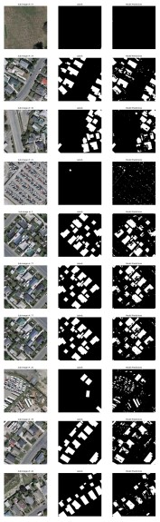

# Roof Detection via U-Net Segmentation Model:

# 1. Objective

The objective of this repository is to document my implementation of U-Net image segmentation model to detect roofs of buildings and othe rstructures from areial color imagery. 

# 2. Specifications

## 2.1 Input Data

As illustrated in ```Figure 2```, the provided input data consists of:

* An ```RGB``` areal image (```image.tif```) with special resolution: ```5000x5000``` pixels.
* The associated roof-top labels ```Binary``` image (```labels.tif```), with the same size.

<p align="center">
  
   
</p>
<p align="center">
  <em>Figure 2: The input areal RGB image (image.tif) and its associated Binary labels image (labels.tif), with spatial resolution: 5000x5000 pixels.</em>
</p>

## 2.2 Objective

To make us of thew input data in order to:
 * To train a Deep Learning model to detect roofs of buildings and other structures
 * To evaluate the performnace of the model.


# 3. Implemented Solutions

My implemented solutions can be outlined as follows:

1. Partition the input image and its associated labels image into a grid of overlapping sub-images
2. Augment the partitioned sub-images using geometrical transformations
3. Split the augmented partitioned sub-images and their associated labels sub-images into training and validation data subsets
4. Train the fully Convolutional Neural Network (CNN) model, as specified by InVision.AI
5. Evaluate the performance of the trained CNN model on the training and validation data subsets
6. Merge the trained model prediction labels obtained from the partitioned sub-images together to generate the model prediction labels for the entire original image
7. Evaluate the performance of the trained model on the entire image and its associated labels image.

Next, we shall describe each of these steps in more details and illutrate sample results.

## 4.1. Image Partitioning

There are several valid reasons for partitioning the provided input data and its associated labels image, including:
* The input areal image and its labels image, with spatial resolution: ```5000x5000``` pixels, are too large to use. This is specially the case due to the stated restriction that the GPU used for training and prediction cannot process patches larger than ```512x512x3``` as the input at a time.
* One may resize the input images into more practical size. However we should not expect to train our model reasonably well using a single image and its associated labels image.

As illustrated in ```Figure 3```, the input image and its associated labels image are partitioned into a ```20x20``` grid of ```slightly-overlapping``` sub-images:
* The overlap between adjacent sub-images ensures more reliable detection results along their borders and reduces detections artifacts near to sub-images boundaries
* As illustrated in ```Table 1```, the implemented image partitioning yields:
  - 20x20 = 400 areal sub-images and associated labels sub-images
  - Each sub-image has a spatial resolution: ```256x256 pixels```, which meets the indicated GPU limitations.
  - The binary labels sub-images have spatial resolution: ```256x256 pixels```.

<p align="center">
  
   
</p>
<p align="center">
  <em>Figure 3: The sizes of the image partition and resulting sub-images and their overlap.</em>
</p>

<div align="center">
<p align="center">
  <em>Table 1: The implemented image partition.</em>
</p>

| Partition Grid | Sub-Images Size (pixels) | Range of Sub-Images Overlap (pixels) |
| :---:         |     :---:      |          :---: |
| 20x20   | 256x256     | 3 (Interior) - 6 (Border)  |

</div>

## 4.2. Data Augmentation

After partitioning the input image and its associated labels image, we obtain 400 sub-images of size ```512x512`` pixels, which can be used to train and validate the CNN model:
* The generated labelled data may not be sufficiently diverse and additional labelled data would benefit training the CNN model
* We augmented the extracted 100 partitioned sub-images by applying the following geometrical transformations on them:
  - Horizontal flip
  - Vertical-flip
  - Both Horizontal and Vertical flips
* This results in quadrupling the amount of labeled data:
  - 400 sub-images  of size ```512x512``` pixels and their associated labels sub-images.
  
* Note that we chose to physically augment the images and store them instead of just applying data augmentation using Python generators because we have insufficient data to work with. As such, we generated and stored additional labelled images to use for training, validating and evaluating the performance of the CNN model.
* ```Figure 4``` illustrates a sample extracted areal sub-image, its associated labels sub-image and their corresponding generated augmentations.
  
<p align="center">
  
  
  
  
</p>
<p align="center">
  
  
  
  
</p>
<p align="center">

<p align="center">
  <em>Figure 4: A partition sub-image, its associated labels sub-image and their horizontal, vertical and horizonal and vertical flip transformations.</em>
</p>

## 4.3. Model Training & Validation Data Split

I split the 400 partitioned sub-images and their associated labels sub-images into training and validation sub-sets as illustrated in ```Table 2```:
* Ideally we should split the available labelled data into 3 subsets:
  - Training data subset
  - Validation subset
  - Test subset
* The CNN model would be traiend and validated on the first 2 subsets and then evaluated on the test data subset, which is consists of unseen data. 
* However, due to the limited amunt of labelled data, I elected to only consider training and validation subsets:
  - The performance of the trained model will then be assessbed using the training and validation data subsets
  * This is not ideal, as the trained model should be evaluated on a test data subset, consisting of previously unseen labelled test data
  * In the proposed improvement section (```Section 7```), we shall propose to collect and annotate more diverse data in order to be able to perform a more comprehensive and unbiased performance eveluation of the trained model. 

<div align="center">
<p align="center">
  <em>Table 2:  Splitting the data set into training and validation subsets.</em>
</p>

| | Training | Validation |
| :---:         |     :---:      |          :---: |
| Percentage  | 80     | 20  |
| Number of Images  | 320    | 80  |

</div>

## 4.4. Training the CNN Model

The trained fully CNN model proposed by InVision.AI has the architecture as illustrated in ```Figure 5```.
  
<p align="center">
  
</p>
<p align="center">

<p align="center">
  <em>Figure 5: The architecture of the trained fully CNN model, as proposed by InVision.AI.</em>
</p>

We experimented with various model training hyper-parameters and the set values of selected key hyper-paramaters are illustrated in ```Table 3```.

<div align="center">
<p align="center">
  <em>Table 3:  The values of the key training hyper-parameters.</em>
</p>

| Hyper-parameter| Value | Justification |
| :---:         |     :---:      |      :---      |        
| Optimizer  | Adam      | Adam is a typically preferred optimized since it combines the best properties of the AdaGrad and RMSProp algorithms to provide an optimization algorithm that can handle sparse gradients on noisy problems. |
| Loss Function  | Binary Cross-Entropy  | Our problem is a Binary Classification Problem: ```Roof``` vs. ```Non-Roof``` |
| Performance Metric     | Accuracy | A meaningful pixel classification metric |
| Batch Size     | 8 | Limited by my available computing resources |
| Number of Epochs   | 100 | Sufficiently high to ensure training convergence. |

</div>


```Figure 6``` illustrates the variations of the accuracy and loss in terms of the number of training epochs, for the training and validation images. We note that after 100 training epochs the model training appears to have converged, in spite of the expected but insignificant random variation of the performance from one epoch to another.  

<p align="center">
  
  
</p>
<p align="center">

<p align="center">
  <em>Figure 6: The variations of the accuracy and loss in terms of the number of training epochs, for the training and validation images.</em>
</p>

## 4.5. Trained Model Performance Evaluation

We evaluated the performance of the trained model on the training and validation data subsets, as illustrated in ```Figure 7``` and ```Figure 8```, respectively:
* As mentioned above, this is not ideal, as the trained model should be evaluated on a test data subset, consisting of previously unseen labelled test data:
  - However, due to the limited amount of labelled data, we only considered training and validation subsets
  - In the proposed improvement section (Section 7), we shall propose to collect and annotate more diverse data in order to be able to perform a more comprehensive and unbiased performance evaluation of the trained model. 

<p align="center">
  
  
</p>
<p align="center">

<p align="center">
  <em>Figure 7: The normalized confusion matrix and the classification report using the training data subset.</em>
</p>

<p align="center">
  
  
</p>
<p align="center">

<p align="center">
  <em>Figure 8: The normalized confusion matrix and the classification report using the validation data subset.</em>
</p>

```Figure 9``` illustrates randomly selected training and validation sub-images and their corresponding labels and model predictions. 
<p align="center">
  
  
</p>
<p align="center">

<p align="center">
  <em>Figure 9: Randomly selected training and validation sub-images and their corresponding labels and model predictions.</em>
</p>


## 4.6. Generating Model Labels Predictions for the Original Input image

Finally, we merged the trained model predictions obtained from the partitioned sub-images together to generate the model labels predictions for the entire original input image (```image.tif```). ```Figure 10``` illustrates the generated model labels predictions for the entire input image and the ground truth labels image (```labels.tif```).

<p align="center">
  
  
</p>
<p align="center">

<p align="center">
  <em>Figure 10: The generated model labels predictions for the entire input image and the ground truth labels image (```labels.tif```).</em>
</p>

## 4.7. Evaluating the Trained Model Performance on the Full Input Image

The performance evaluation of the trained model on the full input image is illustrated in ```Figure 11```. 

<p align="center">
  
  
</p>
<p align="center">

<p align="center">
  <em>Figure 11: The normalized confusion matrix and the classification report using the full input image.</em>
</p>

# 5. Submitted Code

## 5.1 Folder Structure

The folder structure of the submitted software implmentations is as illustrated in ```Figure 12```:
* The ```code``` sub-folder contains the required files for training and deploying the CNN model:
  - ```utils.py```: Contains shared Python imports, global variables and utlity functions
  - ```train.py```: Script for training the model
  - ```inference.py```: Script for deploying the model

* The ```data``` sub-folder contains the input image and its associated labels image:
  - ```image.tif```
  - ```labels.tif```
* The ```output``` sub-folder contains the generated output, which sub-divided into the following 3 sub-folders: 
  - ```training```:  The output generated by the training script, such as illustrated in the previous sections
  - ```trained_model```: The trained model in ```h5``` format (ex. ```roof_top_detection_trained_model_num_epochs_100.h5```)
  - ```inference```: Output generated by the inference script, consisting of the model predictions of the labels of the full input image, as illustrated in ```Figure 10```
* The ```google_colab``` sub-folder: 
  - ```InVisionIA_ML_Exercise.ipynb```:  Contains a Google Colaborary Notebook:
    - I initially developed my solutions using a Google Colab Notebnook
    - This allowed me to explore various solutions and experiemnt with different hyper-paramaters and models using of the Google Colab GPU, as I do not have GPU on my personal laptop.
  - The ```data``` sub-folder contains the input image and its associated labels image should be located on your Google Drive
    - ```image.tif```
    - ```labels.tif```
  - The ```output``` sub-folder contains the generated output, should be located on your Google Drive
* The ```github``` sub-folder contains a screenshot of this GitHub repository access information
* The ```requirements.txt``` file
* The ```README.md``` file
 
<p align="center">
  
</p>
<p align="center">

<p align="center">
  <em>Figure 12: The folder structure of the submitted software implementations.</em>
</p>

## 5.2 Requirements

The content of the ```requirements.txt``` file is as follows: 

```
numpy~=1.23.5
matplotlib~=3.7.1
opencv-python~=4.7.0.72
tensorflow~=2.12.0
pandas~=1.5.3
sklearn~=0.0.post1
scikit-learn~=1.2.2
```

## 5.3 Executing the Code (```train.py``` and ```inference.py```)

Suppose my submitted solutions folder (```InVision_AI_ML_Exercise_MGhazel_Solutions```) is copied to your ```C-Drive```:

1. Navigate to: ```C:\InVision_AI_ML_Exercise_MGhazel_Solutions```:

```(base) C:\InVision_AI_ML_Exercise_MGhazel_Solutions>```

2. List the contents of:  ```C:\InVision_AI_ML_Exercise_MGhazel_Solutions```

```
(base) C:\InVision_AI_ML_Exercise_MGhazel_Solutions>dir
 Volume in drive C is OS
 Volume Serial Number is 34B1-996A
Directory of C:\InVision_AI_ML_Exercise_MGhazel_Solutions
2023-03-25  01:02 PM    <DIR>          .
2023-03-25  01:03 PM    <DIR>          code
2023-03-25  01:03 PM    <DIR>          data
2023-03-25  01:04 PM    <DIR>          google_colab
2023-03-25  12:53 PM    <DIR>          output
               0 File(s)              0 bytes
               5 Dir(s)  916,878,131,200 bytes free
(base) C:\InVision_AI_ML_Exercise_MGhazel_Solutions>
```

3. Change to the ```code``` sub-directory:

```
(base) C:\InVision_AI_ML_Exercise_MGhazel_Solutions>cd code
(base) C:\InVision_AI_ML_Exercise_MGhazel_Solutions\code>
```

4. Open ```utils.py```

5. Edit the model training hyper-parameters, as needed:
  * Currently the model training hyper-parameters are set as illustrated in ```Table 3```. 
  * If you choose to change the number of epochs or batch size, then:
    * Search for ```%%%%%%%%%%%%%%%%%%%%%%%% EDIT MODELS HYPER-PARAMETERS %%%%%%%%%%%%%%%%%%%%%%%%%```
    * Edit the values of these paramaters and save the changes.
    
      ```
      # -------------------------------------------------------------------------------
      # %%%%%%%%%%%%%%%%%%%%%%%% EDIT MODELS HYPER-PARAMETERS %%%%%%%%%%%%%%%%%%%%%%%%%
      # -------------------------------------------------------------------------------
      # Edit the number of training epochs
      # -------------------------------------------------------------------------------
      TRAIN_MODEL_NUM_EPOCHS = 100
      # -------------------------------------------------------------------------------
      # Edit the batch-size
      # -------------------------------------------------------------------------------
      TRAIN_MODEL_BATCH_SIZE = 8
      ```

6. To run the ```train.py``` file, change to the directory: ```C:\InVision_AI_ML_Exercise_MGhazel_Solutions\code``` and excute the following command:
    
```
    (base) C:\InVision_AI_ML_Exercise_MGhazel_Solutions\code>python train.py
```
    
6.1: The logged output of the model training command will be as follows, using 10 epochs for illustration purposes:
    
```
(base) C:\InVision_AI_ML_Exercise_MGhazel_Solutions>cd code
(base) C:\InVision_AI_ML_Exercise_MGhazel_Solutions\code>python train.py
Directory '../output/training\' created successfully
Directory '../output/trained_model\' created successfully
Directory '../output/inference\' created successfully
------------------------------------------------------------------------
The number of GPUs Available on your device:  0
------------------------------------------------------------------------
==================================================================================
## Roof-Top Detection & Segmentation: Deep Learning Model Training:   ##
==================================================================================
Start of execution: 2023-03-25 13:40:30.170458
==================================================================================
Reading the input image: 'image.tif':
The input image: 'image.tif' has shape: (5000, 5000, 3)
Reading the input image labels: 'labels.tif':
The input image labels: 'labels.tif' has shape: (5000, 5000)
The input image partition shape = (400, 512, 512, 3)
The input image partition shape = (400, 512, 512, 1)
2023-03-25 13:40:33.669260: I tensorflow/core/platform/cpu_feature_guard.cc:193] This TensorFlow binary is optimized with oneAPI Deep Neural Network Library (oneDNN) to use the following CPU instructions in performance-critical operations:  AVX AVX2
To enable them in other operations, rebuild TensorFlow with the appropriate compiler flags.
Model: "model"
_________________________________________________________________
 Layer (type)                Output Shape              Param #
=================================================================
 input_1 (InputLayer)        [(None, 512, 512, 3)]     0
 lambda (Lambda)             (None, 512, 512, 3)       0
 conv2d (Conv2D)             (None, 512, 512, 16)      448
 conv2d_1 (Conv2D)           (None, 512, 512, 16)      6416
 max_pooling2d (MaxPooling2D)  (None, 256, 256, 16)     0
 conv2d_2 (Conv2D)           (None, 256, 256, 32)      4640
 conv2d_transpose (Conv2DTra  (None, 512, 512, 32)     4128
 nspose)
 conv2d_3 (Conv2D)           (None, 512, 512, 16)      4624
 conv2d_4 (Conv2D)           (None, 512, 512, 1)       17
=================================================================
Total params: 20,273
Trainable params: 20,273
Non-trainable params: 0
_________________________________________________________________
None
-------------------------------------------------------------------------
Training & Validation Data Sets:
-------------------------------------------------------------------------
Number of Training Images =  320
Number of Validation Images =  80
-------------------------------------------------------------------------
Epoch 1/10
2023-03-25 13:40:37.122347: W tensorflow/tsl/framework/cpu_allocator_impl.cc:82] Allocation of 419430400 exceeds 10% of free system memory.
2023-03-25 13:40:37.127050: W tensorflow/tsl/framework/cpu_allocator_impl.cc:82] Allocation of 419430400 exceeds 10% of free system memory.
2023-03-25 13:40:40.688101: W tensorflow/tsl/framework/cpu_allocator_impl.cc:82] Allocation of 419430400 exceeds 10% of free system memory.
2023-03-25 13:40:40.691952: W tensorflow/tsl/framework/cpu_allocator_impl.cc:82] Allocation of 419430400 exceeds 10% of free system memory.
2023-03-25 13:40:44.487174: W tensorflow/tsl/framework/cpu_allocator_impl.cc:82] Allocation of 419430400 exceeds 10% of free system memory.
40/40 - 168s - loss: 0.4831 - accuracy: 0.8379 - val_loss: 0.4305 - val_accuracy: 0.8362 - 168s/epoch - 4s/step
Epoch 2/10
40/40 - 182s - loss: 0.3825 - accuracy: 0.8406 - val_loss: 0.3600 - val_accuracy: 0.8362 - 182s/epoch - 5s/step
Epoch 3/10
40/40 - 181s - loss: 0.3432 - accuracy: 0.8406 - val_loss: 0.3458 - val_accuracy: 0.8361 - 181s/epoch - 5s/step
Epoch 4/10
40/40 - 177s - loss: 0.3307 - accuracy: 0.8464 - val_loss: 0.3420 - val_accuracy: 0.8397 - 177s/epoch - 4s/step
Epoch 5/10
40/40 - 173s - loss: 0.3262 - accuracy: 0.8625 - val_loss: 0.3295 - val_accuracy: 0.8780 - 173s/epoch - 4s/step
Epoch 6/10
40/40 - 185s - loss: 0.3250 - accuracy: 0.8674 - val_loss: 0.3595 - val_accuracy: 0.8391 - 185s/epoch - 5s/step
Epoch 7/10
40/40 - 192s - loss: 0.3184 - accuracy: 0.8716 - val_loss: 0.3009 - val_accuracy: 0.8831 - 192s/epoch - 5s/step
Epoch 8/10
40/40 - 182s - loss: 0.3001 - accuracy: 0.8831 - val_loss: 0.2940 - val_accuracy: 0.8842 - 182s/epoch - 5s/step
Epoch 9/10
40/40 - 173s - loss: 0.2783 - accuracy: 0.8923 - val_loss: 0.3092 - val_accuracy: 0.8840 - 173s/epoch - 4s/step
Epoch 10/10
40/40 - 171s - loss: 0.2781 - accuracy: 0.8934 - val_loss: 0.2649 - val_accuracy: 0.9032 - 171s/epoch - 4s/step
Results.history.keys() =
dict_keys(['loss', 'accuracy', 'val_loss', 'val_accuracy'])
10/10 - 32s - 32s/epoch - 3s/step
3/3 - 8s - 8s/epoch - 3s/step
-------------------------------------------------------------------------
The Training Images Classification Report:
-------------------------------------------------------------------------
{'False': {'precision': 0.9135944184589252, 'recall': 0.9762752195868446, 'f1-score': 0.943895360334586, 'support': 70512307}, 'True': {'precision': 0.8040194264428958, 'recall': 0.5131764237362186, 'f1-score': 0.6264881776241619, 'support': 13373773}, 'accuracy': 0.9024443984031677, 'macro avg': {'precision': 0.8588069224509105, 'recall': 0.7447258216615316, 'f1-score': 0.7851917689793739, 'support': 83886080}, 'weighted avg': {'precision': 0.896125118788477, 'recall': 0.9024443984031677, 'f1-score': 0.8932918321909569, 'support': 83886080}}
-------------------------------------------------------------------------
The Validation Images Classification Report:
-------------------------------------------------------------------------
{'False': {'precision': 0.912943267907354, 'recall': 0.9774124775129206, 'f1-score': 0.9440785349274909, 'support': 17537293}, 'True': {'precision': 0.8195990705884604, 'recall': 0.5240404900433198, 'f1-score': 0.6393129693029782, 'support': 3434227}, 'accuracy': 0.9031697750091553, 'macro avg': {'precision': 0.8662711692479073, 'recall': 0.7507264837781202, 'f1-score': 0.7916957521152346, 'support': 20971520}, 'weighted avg': {'precision': 0.8976575297860412, 'recall': 0.9031697750091553, 'f1-score': 0.894171130307417, 'support': 20971520}}
-------------------------------------------------------------------------
The input image partition has 100 images.
4/4 - 9s - 9s/epoch - 2s/step
-------------------------------------------------------------------------
The Entire Image Classification Report:
-------------------------------------------------------------------------
{'False': {'precision': 0.9147394093383945, 'recall': 0.9762416224171356, 'f1-score': 0.9444903677667944, 'support': 20998151}, 'True': {'precision': 0.8073848137773668, 'recall': 0.5225492016315458, 'f1-score': 0.6344649959480538, 'support': 4001849}, 'accuracy': 0.90361728, 'macro avg': {'precision': 0.8610621115578807, 'recall': 0.7493954120243407, 'f1-score': 0.7894776818574241, 'support': 25000000}, 'weighted avg': {'precision': 0.8975547341027423, 'recall': 0.90361728, 'f1-score': 0.8948633787992963, 'support': 25000000}}
-------------------------------------------------------------------------------
Model trained successfully on: 2023-03-25 14:13:53, Good-bye!
-------------------------------------------------------------------------------
(base) C:\InVision_AI_ML_Exercise_MGhazel_Solutions\code>
```
    
6.2: To examine the output of the model ```training```, see the contents of the following output subfolders:
* ```C:\InVision_AI_ML_Exercise_MGhazel_Solutions\output\training```:
    
```
(base) C:\InVision_AI_ML_Exercise_MGhazel_Solutions\code>cd ..
(base) C:\InVision_AI_ML_Exercise_MGhazel_Solutions>cd output
(base) C:\InVision_AI_ML_Exercise_MGhazel_Solutions\output>cd training
(base) C:\InVision_AI_ML_Exercise_MGhazel_Solutions\output\training>dir
 Volume in drive C is OS
 Volume Serial Number is 34B1-996A
 Directory of C:\InVision_AI_ML_Exercise_MGhazel_Solutions\output\training
2023-03-25  02:13 PM    <DIR>          .
2023-03-25  01:40 PM    <DIR>          ..
2023-03-25  02:13 PM               391 classification_report_input_image.csv
2023-03-25  02:12 PM               430 classification_report_train_images.csv
2023-03-25  02:13 PM               429 classification_report_valid_images.csv
2023-03-25  02:13 PM         2,420,103 labels.jpg
2023-03-25  02:13 PM           588,963 model_preds_10_sub_images.jpg
2023-03-25  02:10 PM           661,018 model_preds_10_train_images.jpg
2023-03-25  02:11 PM           657,845 model_preds_10_valid_images.jpg
2023-03-25  02:13 PM         3,556,809 model_preds_full_input_image.jpg
2023-03-25  02:13 PM            24,744 non_normalized_confusion_matrix_input_image.jpg
2023-03-25  02:11 PM            23,007 non_normalized_confusion_matrix_train_images.jpg
2023-03-25  02:12 PM            24,048 non_normalized_confusion_matrix_valid_images.jpg
2023-03-25  02:13 PM            21,875 normalized_confusion_matrix_input_image.jpg
2023-03-25  02:11 PM            21,819 normalized_confusion_matrix_train_images.jpg
2023-03-25  02:12 PM            21,881 normalized_confusion_matrix_valid_images.jpg
2023-03-25  01:40 PM           398,431 sample_images_plus_labels.jpg
2023-03-25  02:10 PM            60,792 train_valid_accuracy_vs_epochs.jpg
2023-03-25  02:10 PM            53,704 train_valid_loss_vs_epochs.jpg
              17 File(s)      8,536,289 bytes
               2 Dir(s)  916,871,806,976 bytes free
(base) C:\InVision_AI_ML_Exercise_MGhazel_Solutions\output\training>
```

* ```C:\InVision_AI_ML_Exercise_MGhazel_Solutions\output\trained_model```:
    
```
(base) C:\InVision_AI_ML_Exercise_MGhazel_Solutions\output\training>cd ..
(base) C:\InVision_AI_ML_Exercise_MGhazel_Solutions\output>cd trained_model
(base) C:\InVision_AI_ML_Exercise_MGhazel_Solutions\output\trained_model>dir
 Volume in drive C is OS
 Volume Serial Number is 34B1-996A
 Directory of C:\InVision_AI_ML_Exercise_MGhazel_Solutions\output\trained_model
2023-03-25  02:10 PM    <DIR>          .
2023-03-25  01:40 PM    <DIR>          ..
2023-03-25  02:10 PM           300,264 roof_top_detection_trained_model_num_epochs_10.h5
               1 File(s)        300,264 bytes
               2 Dir(s)  916,871,544,832 bytes free
(base) C:\InVision_AI_ML_Exercise_MGhazel_Solutions\output\trained_model>
```
    
7. To run the ```inference.py``` file, change to the following directory: ```C:\InVision_AI_ML_Exercise_MGhazel_Solutions\code``` and excute the following command
    
```
(base) C:\InVision_AI_ML_Exercise_MGhazel_Solutions\code>python inference.py
------------------------------------------------------------------------
The number of GPUs Available on your device:  0
------------------------------------------------------------------------
==================================================================================
## Roof-Top Detection & Segmentation: Deep Learning Model Inference:   ##
==================================================================================
Start of execution: 2023-03-25 14:17:58.353117
==================================================================================
../output/trained_model\
['../output/trained_model\\roof_top_detection_trained_model_num_epochs_10.h5']
A single trained model file is found is: ../output/trained_model\roof_top_detection_trained_model_num_epochs_10.h5
2023-03-25 14:17:58.439253: I tensorflow/core/platform/cpu_feature_guard.cc:193] This TensorFlow binary is optimized with oneAPI Deep Neural Network Library (oneDNN) to use the following CPU instructions in performance-critical operations:  AVX AVX2
To enable them in other operations, rebuild TensorFlow with the appropriate compiler flags.
Trained model file: ../output/trained_model\roof_top_detection_trained_model_num_epochs_10.h5 is loaded successfully!
Reading the input image: 'image.tif':
The input image: 'image.tif' has shape: (5000, 5000, 3)
The input image partition shape = (400, 512, 512, 3)
2023-03-25 14:17:59.480059: W tensorflow/tsl/framework/cpu_allocator_impl.cc:82] Allocation of 536870912 exceeds 10% of free system memory.
2023-03-25 14:17:59.754622: W tensorflow/tsl/framework/cpu_allocator_impl.cc:82] Allocation of 536870912 exceeds 10% of free system memory.
2023-03-25 14:18:00.822726: W tensorflow/tsl/framework/cpu_allocator_impl.cc:82] Allocation of 1073741824 exceeds 10% of free system memory.
2023-03-25 14:18:01.374016: W tensorflow/tsl/framework/cpu_allocator_impl.cc:82] Allocation of 536870912 exceeds 10% of free system memory.
2023-03-25 14:18:02.008517: W tensorflow/tsl/framework/cpu_allocator_impl.cc:82] Allocation of 536870912 exceeds 10% of free system memory.
13/13 - 31s - 31s/epoch - 2s/step
Model predictions for image partition have been generated successfully!
Model predictions for the full input image have been generated successfully!
Model predictions for the full input image have saved to: ../output/inference\model_preds_full_input_image.jpg
-------------------------------------------------------------------------------
Model Deployed Successfully on: 2023-03-25 14:18:30, Good-bye!
-------------------------------------------------------------------------------
(base) C:\InVision_AI_ML_Exercise_MGhazel_Solutions\code>
```
      
* To examine the output of the model ```inference```, see the contents of the following output subfolder: ```C:\InVision_AI_ML_Exercise_MGhazel_Solutions\output\inference```:
    
```
(base) C:\InVision_AI_ML_Exercise_MGhazel_Solutions\code>cd ..
(base) C:\InVision_AI_ML_Exercise_MGhazel_Solutions>cd output
(base) C:\InVision_AI_ML_Exercise_MGhazel_Solutions\output>cd inference
(base) C:\InVision_AI_ML_Exercise_MGhazel_Solutions\output\inference>dir
 Volume in drive C is OS
 Volume Serial Number is 34B1-996A
 Directory of C:\InVision_AI_ML_Exercise_MGhazel_Solutions\output\inference
2023-03-25  02:18 PM    <DIR>          .
2023-03-25  01:40 PM    <DIR>          ..
2023-03-25  02:18 PM         3,556,809 model_preds_full_input_image.jpg
               1 File(s)      3,556,809 bytes
               2 Dir(s)  916,869,746,688 bytes free
(base) C:\InVision_AI_ML_Exercise_MGhazel_Solutions\output\inference>  
```

## 5.4 Executing the Google Colab Notebook: ```InVisionIA_ML_Exercise.ipynb```

* To execute the Google Colaboratory Notebook, please follow the following steps:
1. Create a folder (ex. ```temp```) on your Google Drive (```My Drive```) 
2. Create a ```code``` sub-folder and copy the ```InVisionIA_ML_Exercise.ipynb``` to ```My Drive\temp\code```
3. Create a sub-folder ```data``` and copy the input data ```image.tif``` and ```labels.tif``` to ```My Drive\temp\data```
4. Create a sub-folder ```output``` so the output will be saved to ```My Drive\temp\output```
5. Open ``InVisionIA_ML_Exercise.ipynb``` using Google Colaborator
6. Edit the ```DATA_PATH``` and ```OUTPUT_PATH``` to point to your ```data``` and ```output``` sub-folders described above
    ```
    #-------------------------------------------------------------------------------
    #%%%%%%%%%%%%%%%%%%%%%%%%%%%%%%% EDIT DATA_PATH %%%%%%%%%%%%%%%%%%%%%%%%%%%%%%%%
    #-------------------------------------------------------------------------------
    # Set the data path: Relative to my Google Drive
    #-------------------------------------------------------------------------------
    # - contains the image.tiff and its binary mask: labels.tif
    DATA_PATH = "/content/drive/MyDrive/Colab_Notebooks/InvisionAI/data/"

    #-------------------------------------------------------------------------------
    #%%%%%%%%%%%%%%%%%%%%%%%%%%%%%%% EDIT OUTPUT_PATH %%%%%%%%%%%%%%%%%%%%%%%%%%%%%%%%
    #-------------------------------------------------------------------------------
    # Set the output path: Relative to my Google Drive
    #-------------------------------------------------------------------------------
    # The output will be saved here
    OUTPUT_PATH = '/content/drive/MyDrive/Colab_Notebooks/InvisionAI/output/'
    ```
7. Explore the Notebook and experiment with:
  * Using different hyper-parameters
  * Training and deploying a more complex U-NET model instead of the model proposed by InVision.AI.


# 6. Trained Model Performance Assessment & Proposed Improvements

## 6.1 Performance Assessment

In view of the presented prediction results, we make the following observations:
* Based on its performance on the full image, as illustrated in ```Figure 11```, the trained model achieved:
  - High true positive rate
  - Low false-negative rate
* However, the trained model suffered from relatively high false-positive rate: 
  - Some of the false positive detections appear to be due to mis-classifications of structures that appear like a roof, but they are actually not a roof, including:
    - The top of large vehicles and metal structures
    - Flat smooth or paved ground surfaces and terrains
    - Others.
    
## 6.2 Proposed Improvements

## 6.2.1 Collecting and Labelling More Diverse Data
In view of the model performance assessment above, it appears that one of the main drawbacks of the trained model lies in its high false-positive detection rate:
  - Thus, the model may benefit from collecting and annotating more diverse training data
  - Additional labelled data should especially contain more examples similar to the observed model false positive detections, including surfaces similar to roof tops, such as tops of large vehicles and metal structures, flat smooth or paved ground surfaces and terrains, etc. 
  - Adding a sufficient amount of such examples will likely help the model learn the subtle differences between actual roof tops and other similar structures and reduce its false detection rate. 


## 6.2.2 Hyper-Parameters Tuning & Data Augmentation

As mentioned previously, I experimented with tuning few key model training hyper-paramaters, such as the number of epochs and the batch size:
  - A more comprehensive hyper-parameter fine-tuning using grid-seach or random search algorithms is recommended. 
  - Such comprehensive hyper-parameter fine-tuing is likely to improve the model performance
  - Applying a more comprehensive data augemntation of the annotated data, using ```TensorFlow ImageDataGenerator```, including:
    - Geometrical flipping, shifting and rotation transformations
    - Pixel-based transformations
    - Such data augmentation should increase the volume and diversity of teh training data and imrove the model training, learning and generalization.  

## 6.2.3 Exploring More Complex Models: U-Net

The undertaken problem of roof-top detection and segmentation from areal imagery is a classifical image segmentation problem:
* U-Net and its variations are well proven image segmentation deep learning models, which have been shown to perform well, especially in segmenting medical images as well as for other image segmentation applications. 
* In the submitted Google Colab Notebook (```Section 5.1```), I experimented with implementing a U-Net model, with architecture as illustrated in ```Figure 13```.

<p align="center">
  
</p>
<p align="center">

<p align="center">
  <em>Figure 13: The architecture of the trained U-Net model.</em>
</p>

The performance of the trained model U-Net model on the full input image is illustrated in ```Figure 14```:
* We note that trained U-Net model performs significantly better than the implemented simpler CNN model, with performance illustrated in ```Figure 11```
* However, it appears that the trained U-Net model is over-fitting as it is achieving exceptionally high precision and recall performance on the training data (full image)
* This model should be re-trained and re-evaluated more comprehensively whenever more labelled data is collected to assess its practical performance and determine how well it performs on previously unseen data.

<p align="center">
  
  
</p>
<p align="center">

<p align="center">
  <em>Figure 14: The U-Net normalized confusion matrix and the classification report using the entire input image.</em>
</p>

## 6.2.4 Proposed Improvements to the Implemented Code

For this task, I aimed to develop a efficient, modularized and well documented code. However, additional improvements can be made to further improve my implementations, including:

* Pass some of the key hyper-parameters, such as the number of epochs and batch-sze, as command-line arguments for ```train.py```:
  - This will make it easier to experiment with different parameters values without the need to edit the ```utils.py``` file. 
  - In our case, we first prototyped our solution using Google Colaboratory Jupyter Notebook, which allowed us to:
    - Make use of GPU processing in Google Colab
    - Experiment with different combinations model hyper-parameters and select good defaut values
    - Experiment with more complex model structures, such as U-Net. 
  
* Breakup some of the ultility functions into smaller functionalities in order to to reduce the complexity and improve readibility and usability

* Integrate Exception Handling in order to handle potential occurance of various types of Exception errors and ensure that each functionality terminates gracefully and not crashing.

* Also, given more time and resources, we can perform additional code factoring, documentation and further optimize each step of our implemented solution.
* Finally, it should be noted that this task was developed as a stand-alone individual task. However, when developing code in a Collaborative Software Development Environment, we explect to develop code incrementally and iteratively such that:
  - A highly-modular software design is first developed and submitted for review and discussion
  - Then, each module is developed, tested and submitted for code review and collected feedback is addressed before starting the development of the next module.
  - As the modules are integrated into the solution system, unit as well as system tests are performed and validated. 
  
This completes the documentation of the task. Your feedback is very much appreciated. 

